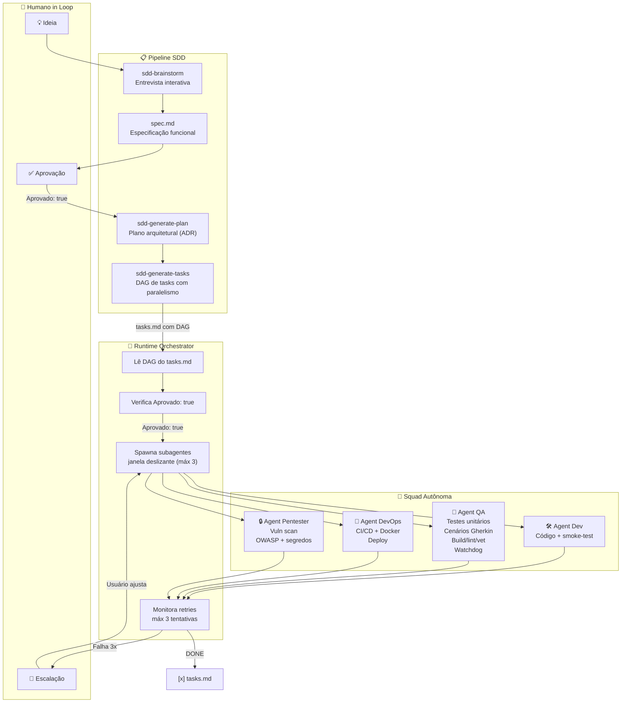

# 42_chat

> Squad autônoma de agentes de IA guiada por humanos in loop.
> Spec-Driven Development com orquestrador, agentes especializados e pipeline fully automated.

## Arquitetura



## Fluxo de Desenvolvimento

### 1. Brainstorm da Feature
```bash
# O agente conduz entrevista interativa e gera spec.md
/skill sdd-brainstorm
```

### 2. Geração de Artefatos SDD
```bash
# Gera plan.md (decisões arquiteturais)
/skill sdd-generate-plan

# Gera tasks.md com DAG (fases, dependências, paralelismo)
/skill sdd-generate-tasks
```

### 3. Aprovação Humana
Edite o `spec.md` da feature e altere:
```yaml
Aprovado: true   # ← false → true
```

### 4. Execução Autônoma
```bash
# O orquestrador spawna a squad e gerencia a execução
agent-run runtime-orchestrator "orquestra a feature <ID>"
```

### 5. Intervenção (se necessário)
O orquestrador só escala pro humano quando uma task falha 3 vezes.
Tasks paralelas continuam rodando — só a sub-árvore dependente é pausada.

---

## Setup do Ambiente

### Pré-requisitos
- [Hermes Agent](https://hermes-agent.nousresearch.com) instalado
- Go 1.21+ (para o projeto)
- Git

### 1. Clonar o repositório
```bash
git clone <repo-url>
cd 42_chat
```

### 2. Configurar skills

As skills do projeto vivem em `.hermes/skills/` versionadas no repositório.
O Hermes Agent descobre skills via symlinks planos em `~/.hermes/skills/<categoria>/`.

```bash
# Script automatizado (recomendado)
./scripts/setup-skills.sh

# Ou manualmente, uma por uma:
mkdir -p ~/.hermes/skills/sdd
ln -sf "$(pwd)/.hermes/skills/sdd/brainstorm" ~/.hermes/skills/sdd/brainstorm
ln -sf "$(pwd)/.hermes/skills/sdd/explore-tech" ~/.hermes/skills/sdd/explore-tech
ln -sf "$(pwd)/.hermes/skills/sdd/generate-plan" ~/.hermes/skills/sdd/generate-plan
ln -sf "$(pwd)/.hermes/skills/sdd/generate-tasks" ~/.hermes/skills/sdd/generate-tasks
ln -sf "$(pwd)/.hermes/skills/sdd/init-repo" ~/.hermes/skills/sdd/init-repo
ln -sf "$(pwd)/.hermes/skills/sdd/refactor-artifact" ~/.hermes/skills/sdd/refactor-artifact
ln -sf "$(pwd)/.hermes/skills/sdd/validate" ~/.hermes/skills/sdd/validate

mkdir -p ~/.hermes/skills/general
ln -sf "$(pwd)/.hermes/skills/general/skill-forge" ~/.hermes/skills/general/skill-forge

mkdir -p ~/.hermes/skills/agent
ln -sf "$(pwd)/.hermes/skills/agent/agent-run" ~/.hermes/skills/agent/agent-run

mkdir -p ~/.hermes/skills/doc
ln -sf "$(pwd)/.hermes/skills/doc/extract" ~/.hermes/skills/doc/extract
ln -sf "$(pwd)/.hermes/skills/doc/generate-toc" ~/.hermes/skills/doc/generate-toc
ln -sf "$(pwd)/.hermes/skills/doc/generate-llms-txt" ~/.hermes/skills/doc/generate-llms-txt
```

### 3. Verificar instalação
```bash
hermes skills list | grep sdd
# Deve listar: brainstorm, explore-tech, generate-plan, generate-tasks,
#              init-repo, refactor-artifact, validate
```

### 4. Agentes (futuro)
Quando os agentes da squad forem implementados (features 005-009), o mesmo padrão
de symlink se aplica em `~/.hermes/agents/`.

---

## Estrutura do Projeto

```
42_chat/
├── .github/
│   ├── memory/
│   │   ├── constitution.md    # Regras invioláveis do projeto
│   │   └── tech.md            # Stack homologado
│   └── workflows/             # CI/CD (GitHub Actions)
├── .hermes/
│   ├── skills/                # Skills versionadas (34 skills)
│   │   ├── sdd/               #   Pipeline SDD (7)
│   │   ├── wiki/              #   Knowledge management (15)
│   │   ├── obsidian/          #   Formato + tooling (5)
│   │   ├── visual/            #   Diagramas Mermaid (1)
│   │   ├── agent/             #   Runners de agente (1)
│   │   ├── doc/               #   Documentação (3)
│   │   ├── general/           #   Tooling (1)
│   │   └── github/            #   Git workflow (1)
│   └── agents/                # Definições de agentes
├── wiki/                      # 🆕 Vault Obsidian versionado
│   ├── index.md               #   Índice mestre
│   ├── log.md                 #   Log de atividades
│   ├── concepts/              #   Padrões, arquitetura
│   ├── entities/              #   Ferramentas, agentes
│   ├── skills/                #   Skills e uso
│   ├── references/            #   APIs, specs
│   ├── synthesis/             #   Análises cross-cutting
│   ├── journal/               #   Sessões e decisões
│   ├── projects/              #   Features e ciclo de vida
│   ├── _meta/                 #   Taxonomia, bases
│   └── _raw/                  #   Capturas brutas
├── specs/
│   ├── BACKLOG.md             # Backlog de features + skills
│   └── features/
│       ├── 001-start-repo/
│       ├── 002-sdd-templates/
│       ├── 003-forge-skill/
│       ├── 004-sdd-tasks-dag/
│       └── 005-runtime-orchestrator/
└── scripts/
    └── setup-skills.sh        # Script de setup para novos membros
```

---

## Squad (visão futura)

| Agente | Feature | Responsabilidade | Skills |
|--------|---------|-----------------|--------|
| **Dev** | 006 | Código + smoke-test. Nunca loga, nunca testa unitário | `go-implement`, `go-refactor`, `smoke-check` |
| **QA** | 007 | Multi-função: unit tests, Gherkin, build/lint, watchdog | `go-unit-tests`, `gherkin-scenarios`, `local-test-runner`, `test-watcher` |
| **DevOps** | 008 | Docker, CI/CD, deploy, monitoramento | `docker-build`, `ci-validate`, `deploy-staging` |
| **Pentester** | 009 | Segurança: vuln scan, OWASP, segredos | `dependency-scan`, `owasp-check`, `secret-scan` |

Cada agente é spawnado pelo runtime-orchestrator com um **subset de skills**
selecionado conforme o micro-contexto da task (campo `Papel` + `Arquivos` no tasks.md).

---

## Atualizado em
2026-06-12
