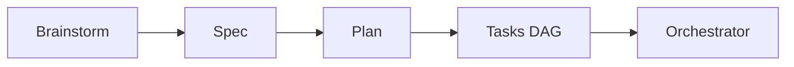

# mermaid-visualizer

> Transforma descrições textuais em diagramas Mermaid. Documentação visual sem sair do markdown.

## Localização
`.hermes/skills/visual/mermaid-visualizer/SKILL.md`

## Quando usar
- Documentar arquitetura de features
- Visualizar pipeline SDD
- Diagramas de sequência para cenários BDD
- Mapas mentais de conceitos

## Tipos de diagrama

| Tipo | Quando usar |
|---|---|
| Flowchart | Fluxos de decisão, pipelines |
| Sequence | Interações entre agentes/sistemas |
| Class | Estrutura de dados, modelos |
| ERD | Banco de dados, entidades |
| Gantt | Cronograma de features |

## Exemplo

## Relacionado
- [[skills/json-canvas|json-canvas]] — Canvas nativo do Obsidian
- [[concepts/sdd-workflow|SDD Workflow]] — Pipeline que o mermaid documenta
- [[concepts/obsidian-flow|Fluxo Obsidian]] — Onde os diagramas vivem

## Buscando conhecimento compilado
Use [[skills/wiki-query|wiki-query]] para buscar diagramas Mermaid existentes no vault, padroes visuais, ou conceitos que precisam de visualizacao antes de agir.